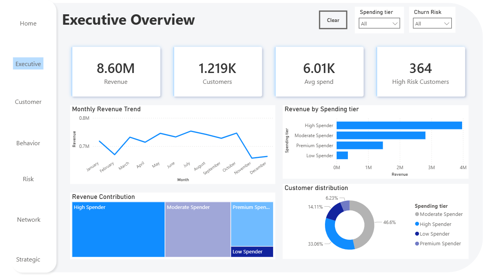
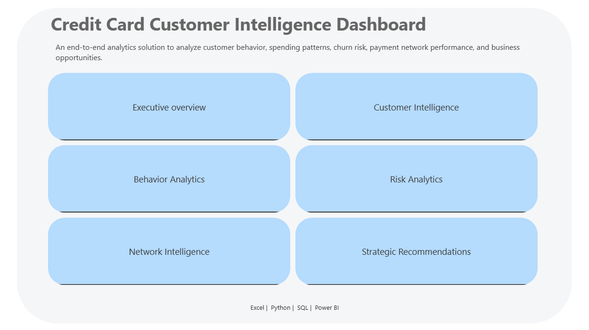
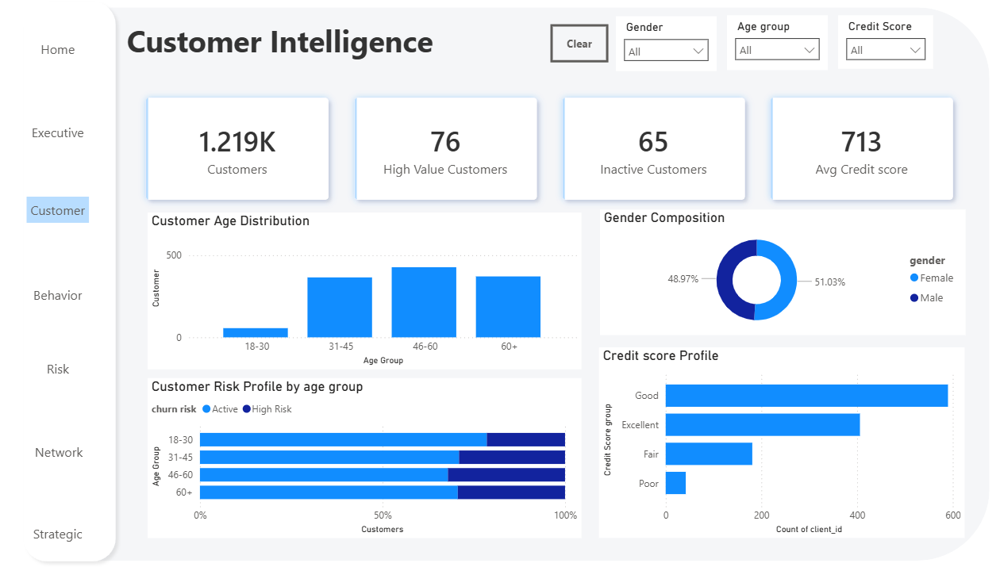
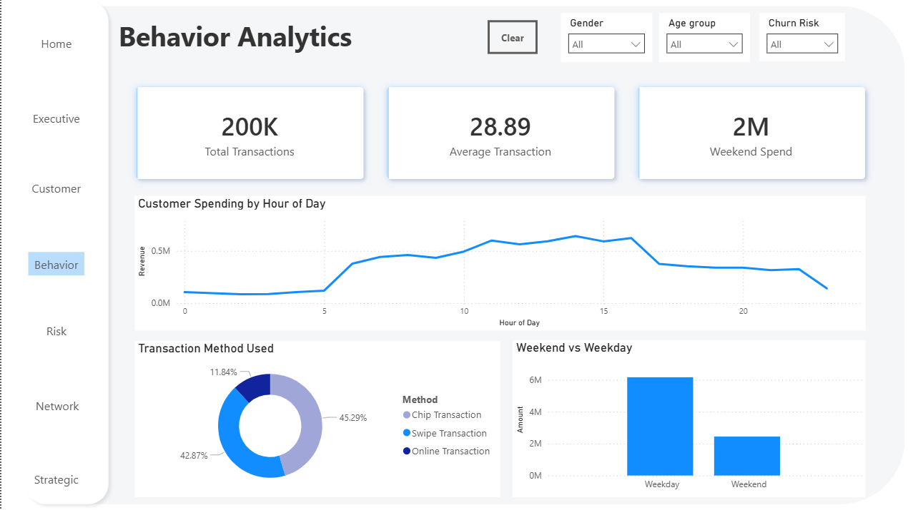
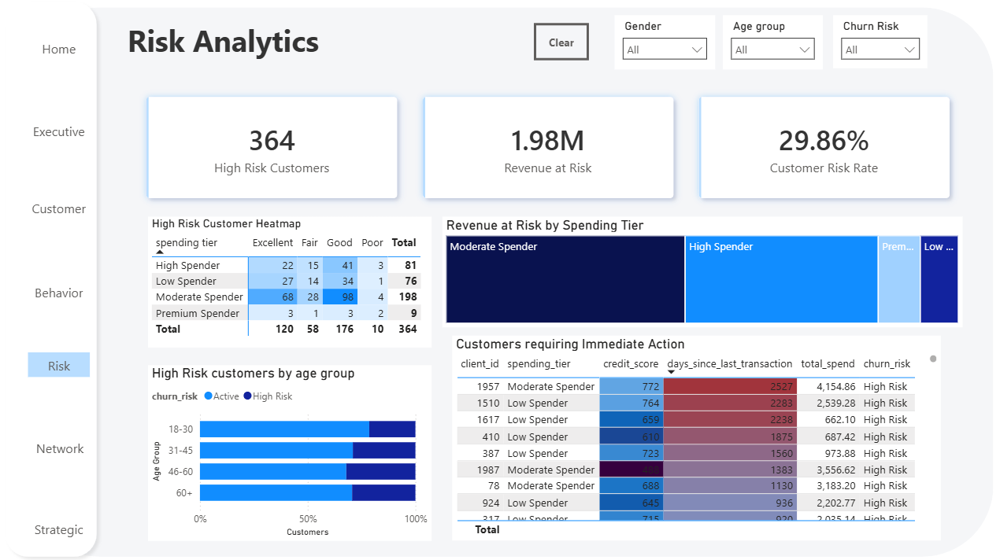
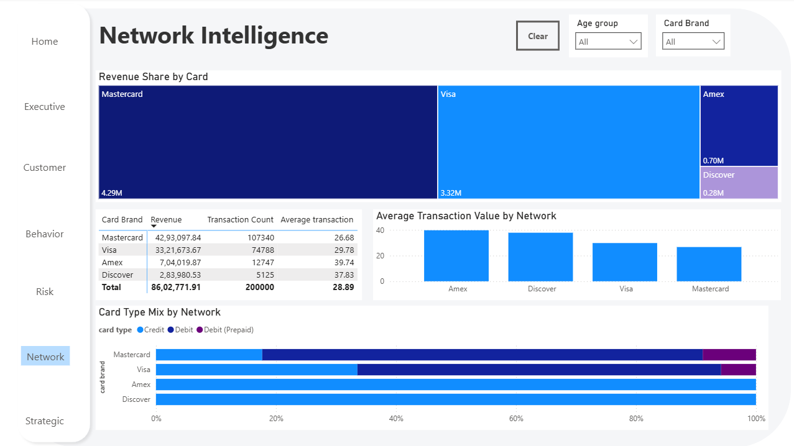
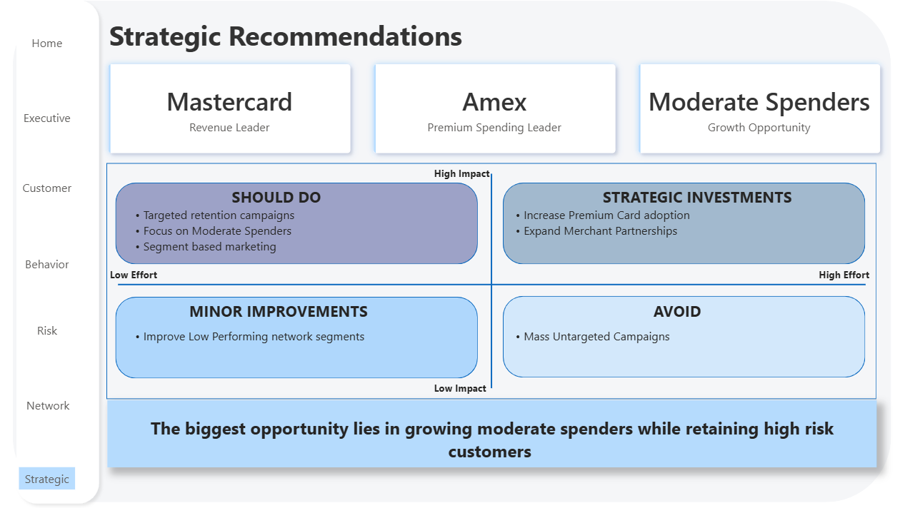

# Credit Card Customer Intelligence and Risk Analytics

End-to-end analytics project using Python, Excel, SQL and Power BI.

## Overview

This project analyzes credit card customer behavior, spending patterns, churn risk, payment network performance, and business growth opportunities through an interactive Power BI dashboard.

---

## Home Page

**Business Question:** How is the analytics solution structured?

This page serves as the navigation hub for all dashboard modules.

---

## Executive Overview

**Business Question:** How is the business performing overall?

### Key Insights

- Revenue exceeded ₹8.6M
- Customer base consists of 1,219 customers
- Average customer spend is above ₹6K
- 364 customers were identified as high risk
- High Spenders generate the largest revenue contribution

---

## Customer Intelligence

**Business Question:** Who are our customers?

### Key Insights

- Most customers belong to the 31–60 age group
- Gender distribution is nearly balanced
- Most customers maintain Good or Excellent credit scores
- High-risk customers are present across all age groups
- A small segment of high-value customers contributes significant business value

---

## Behavior Analytics

**Business Question:** How do customers spend and transact?

### Key Insights

- Spending activity peaks during afternoon hours
- Swipe transactions are the most commonly used payment method
- Weekday spending exceeds weekend spending
- Average transaction value is ₹28.89

---

## Risk Analytics

**Business Question:** Which customers are most likely to churn?

### Key Insights

- Customer risk rate stands at 29.86%
- Revenue at risk exceeds ₹1.9M
- Moderate Spenders contribute the largest revenue-at-risk segment
- Several customers require immediate retention efforts

---

## Network Intelligence

**Business Question:** Which payment networks perform best?

### Key Insights

- Mastercard generates the highest revenue
- Amex records the highest average transaction value
- Visa maintains strong transaction volume
- Card preferences vary across networks

---

## Strategic Recommendations

**Business Question:** What actions should the business take next?

### Recommendations

- Retain high-risk customers through targeted campaigns
- Focus on Moderate Spenders as the primary growth segment
- Increase Premium Card adoption
- Expand merchant partnerships

### Final Insight

> The biggest growth opportunity lies in converting Moderate Spenders into High Spenders while retaining customers identified as high risk.

---

## Key Business Findings

- Mastercard emerged as the revenue leader
- Amex customers showed the highest average transaction value
- Nearly one-third of customers are at risk of churn
- Moderate Spenders represent the strongest growth opportunity
- Swipe remains the dominant transaction method

---

## Tools Used

- Python
- Excel
- SQL
- Power BI
